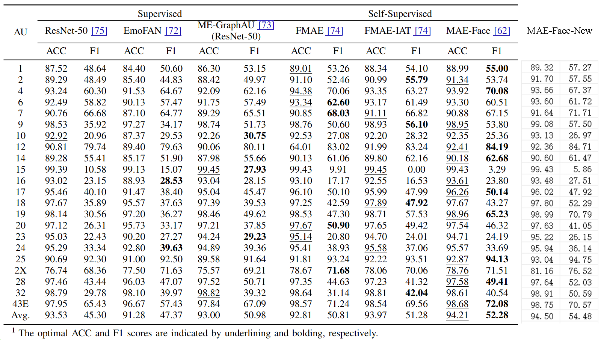
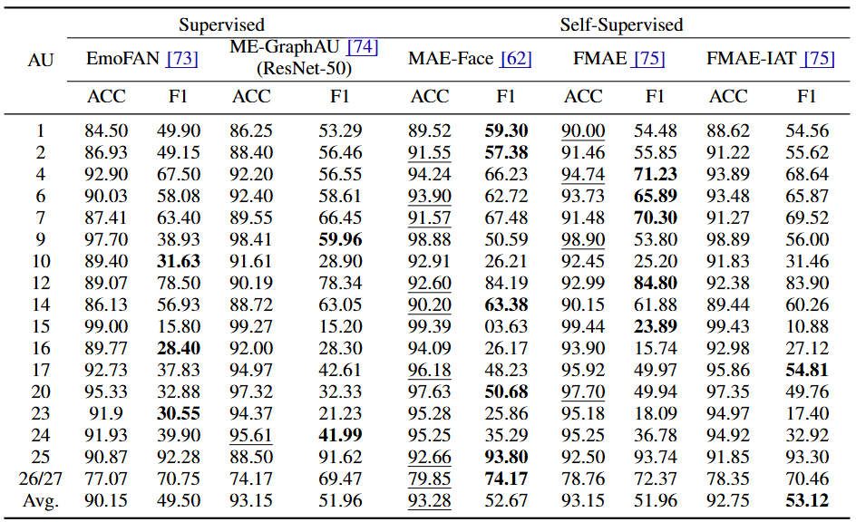

## <div align="center"> Hugging Rain Man: A Novel Dataset for Analyzing Facial Action Units in Children with Autism Spectrum Disorder </div>

<div align="center">
<a href="https://arxiv.org/abs/2411.13797"></a> 
    <div>
        
    </div>
</div>

## Introduction

This repository contains the annotated Action Unit (AU) and Action Descriptor (AD) labels for the HRM dataset, 
along with pre-trained models for facial action detection and atypical expression regression. The dataset consists of 131,758 frames, 
organized into 1,535 segments. The original images themselves are not publicly available due to privacy and 
ethical considerations. However, the AU labels, machine-extracted features and pre-trained models are provided to facilitate 
research and development in the field of children facial expression analysis, particularly for Autism Spectrum Disorder (ASD).

## Dataset Description
**The publicly available data and models are exclusively for non-commercial research
purposes, including but not limited to academic studies and scientific exploration. Any
commercial use or use for profit-making activities is strictly prohibited.**

### Overview
- **Participants**: ASD:66; TD:32
- **Age Range**: 2-12 years old
- **Total Frames**: 131,758
- **Segments**: 1,535
- **Action Units and Action Descriptors**: 22AUs + 10ADs
- **Atypical Rating**: Annotated by 5 people
- **Facial Expression**: It is obtained by soft voting using 3 algorithms
- **Ethnicity**: Chinese
- **Race**: East Asian

### Labels, Machine-extracted Features, and Pre-trained Models

- **Model**: ResNet-50, EmoFAN, ME-GraphAU, MAE-Face, FMAE
- **Training Data**: HRM dataset
- **Selected 22 AUs/ADs for detection**: AU1, AU2, AU4, AU6, AU7, AU9, AU10, AU12, AU14, AU15, AU16, AU17, AU18, AD19, AU20, AU23, AU24, AU25, AU2X (AU26/27), AU28, AD32, and AU43E.
- **Selected 17 AUs/ADs for detection**: AU1, AU2, AU4, AU6, AU7, AU9, AU10, AU12, AU14, AU15, AU16, AU17, AU20, AU23, AU24, AU25 and AU2X (AU26/27).
- **Performance Metrics**: Accuracy, F1-Score
- **Machine-extracted Features**: InsightFace and OpenFace features (5 key points, head pose and bounding box, etc)


### Pre-trained Model Download Links
- **Baidu Cloud (17/22AU Pre-trained Models, Machine-extracted Features and Labels)**: [Download Link](https://pan.baidu.com/s/1hMCuq4L892kl092uiDjrvw), pwd:CCNU
- **Mega Cloud (22AU Pre-trained Models and Machine-extracted Features)**: [Download Link](https://mega.nz/folder/GVYRmbKa#5vfygvAm0mYl_h-6YbFzAQ
)

### Pre-trained Models Usage
We provide a demo for single and batch AU prediction. Please refer to the [Predict](https://github.com/Jonas-DL/Hugging-Rain-Man/tree/main/Predict) folder.
You are recommended to use **MAE series model weights** for predictions.
 
- Clone the entire project from the GitHub repositories of various algorithms.
- Install the required libraries, place the scripts in the project root directory, and download the corresponding weight files to run the tests.

Differences in facial structure and cultural variations in emotional
expression may lead to reduced performance when the model
is applied to non-East Asian populations. Additionally, given
that our dataset is limited to children aged 2-12 years, the
model’s ability to generalize to individuals outside of this
age range may also be compromised. Researchers using this
dataset and model should be mindful of these factors, as
the results may not fully represent broader, more diverse
populations.

### User-friendly Integrated Demo for AU Detection (Windows)
For users unfamiliar with environment setup, we offer a user-friendly integrated demo for **Windows** based on the MAE series models.

Download link:  
- [Baidu Cloud](https://pan.baidu.com/s/1xX6LreuEKcyknTUSF4hbNQ) pwd: CCNU 
- [Google Drive](https://drive.google.com/file/d/1wU22vKpG-ZY4Nw5wqCLPcD0ieNBaEXxN/view?usp=drive_link)

1. **Prepare Data and Weights**  
   1. Place the images for prediction in the `FMAE/imgs/` folder. For example 1.jpg, 2.jpg, 3.jpg, etc.  Please make sure that there is only one face in the image.
   2. If you are not familiar with how to align faces, we recommend using OpenFace 2.2.0 for face alignment. The official download link is: https://github.com/TadasBaltrusaitis/OpenFace/releases/tag/OpenFace_2.2.0. After downloading, run OpenFaceOffline.exe, check 'Record aligned faces' under the 'Record' menu, and set the output image size to 224x224 under 'Recording settings'. Finally, select your video or image from the 'File' menu. The aligned faces will be saved in the OpenFace/processed directory (in the xxxx_aligned folder). Move the images from this folder to the `/FMAE/imgs/` directory.
   3. Place the downloaded weight files in the `FMAE/ckpt/` folder.

2. **Run the Demo**  
   1. Double-click `run_MAEFACE.bat` to execute.  
   2. The prediction results will be saved in the `FMAE/results/` folder.
   3. We recommend using a GPU with at least 8GB of VRAM to speed up inference. The default parameters (batch_size=8, num_workers=4, model_weight, etc.) can be modified in HRM_test_batch.py

3. **Demo User Guide**
   1. Please refer to Guide.pptx

## AU Detection Baseline

### 22 AU


### 17 AU


## AU/AD Annotation Tool 
We provide an additional AU annotation tool that you need to install the PySimpleGUI library in advance.
<div align="center">
   
</div>

### Buttons
- **Open data path**: Path where the annotated data (.csv) will be saved.
- **Confirm**: Enter the participant you are currently annotating, and clicking this button will generate P-X.csv in the specified data path.
- **Open current frame**: Open the current frame image. This function is optional. You can also directly use your preferred image viewer to open the frames to be annotated.
- **Natural frame**: Open the Natural frame image.
- **Play backwards X frames**: Use OpenCV to start playing from the (current_frame_num - X) frame.
- **Clear Checkbox**: Clear all checkboxes.
- **Submit**: Submit the final AU/AD annotations. The number in the Frame input box will automatically increase by 1.

### Input Box
- **Participant**: Enter the participant name: P1, P2, etc.
- **Frame**:  Open the input frame image, and the relative address of the image can be changed by yourself.
   ```python
   img_path = os.path.join(folder_path + '/origin/' + object_name, f"{current_frame}_0.jpg")
   ```
- **LRTB**: Enter the direction of the AU. For example, if AU2 is activated on the right side, enter 2 in the R input box.


## Acknowledgment
We would like to express our gratitude to the following excellent open-source projects: [JAA-Net](https://github.com/ZhiwenShao/PyTorch-JAANet),[EmoFAN](https://github.com/face-analysis/emonet), [EmoFAN4AU-Detection](https://github.com/jingyang2017/aunet_train), 
[ME-GraphAU](https://github.com/CVI-SZU/ME-GraphAU), [MAE-Face](https://github.com/FuxiVirtualHuman/MAE-Face), 
[FMAE](https://github.com/forever208/FMAE-IAT), [EAC](https://github.com/zyh-uaiaaaa/Erasing-Attention-Consistency), 
[Poster++](https://github.com/talented-q/poster_v2), and [DDAMFN++](https://github.com/SainingZhang/DDAMFN).
## Citation
if the data or method help you in the research, please cite the following paper:
```
@article{ji2024hugging,
  title={Hugging Rain Man: A Novel Facial Action Units Dataset for Analyzing Atypical Facial Expressions in Children with Autism Spectrum Disorder},
  author={Yanfeng Ji, Shutong Wang, Ruyi Xu, Jingying Chen, Xinzhou Jiang, Zhengyu Deng, Yuxuan Quan, Junpeng Liu},
  journal={arXiv preprint arXiv:2411.13797},
  year={2024}
}
```
